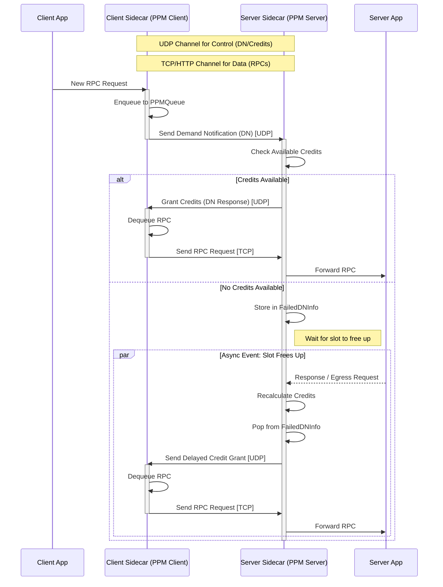
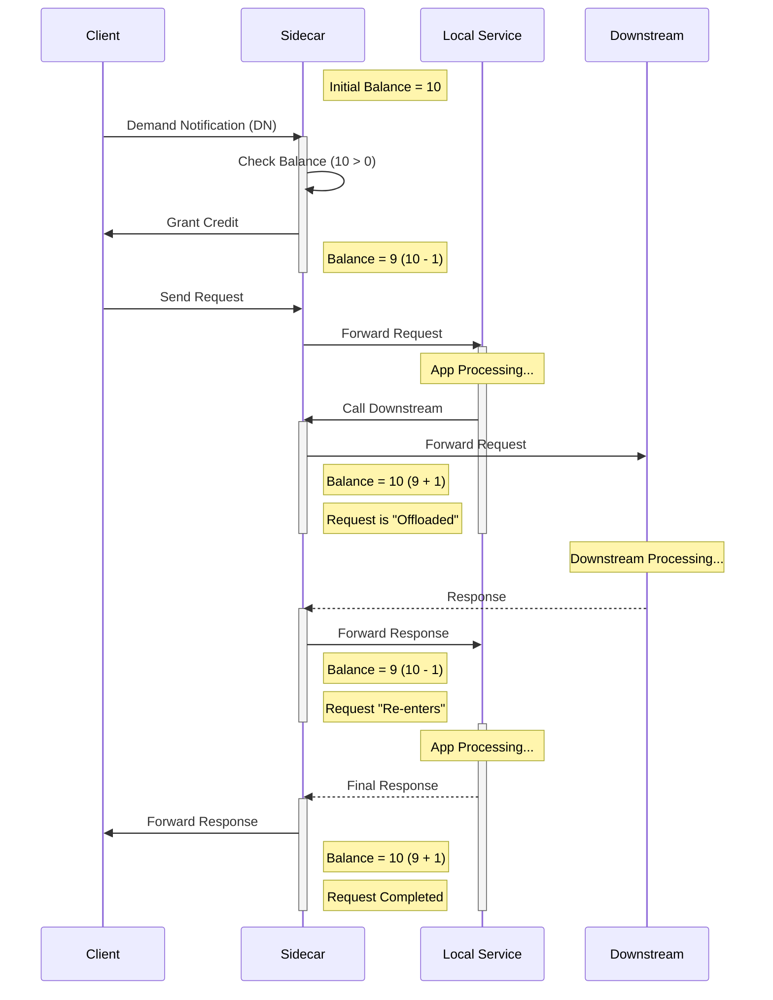

PPM is a protocol that ensures services only receive requests up to their configured limit.

# Message Types
1. Demand Notification (DN): Used to inform a server that the client has a number of requests to send. An important field is "requested credits". Note that this is only sent for new arriving requests to the client.
2. Credit response: It uses a the same header and structure as DN. It is distinguished from DN by setting a field. An important field is "granted credits". This type is the explciit response to a DN. In other words, there is a 1-to-1 mapping between DN and credit response.

# Protocol State
PPM is a stateful protocol, so both client and server rely on some state variables.

## Client-side
1. PPMQueue: It holds requests that should be sent to server using the PPM protocol.

## Server-side
1. sent_credits: This is the number of credits already sent to the client(s).
2. per_method_resp_in: This counter shows the number of complete requests that is (or about to) exit from the sidecar to the clients.
3. downstream_concurrency: This counts the number of requests that are on fly to other dosntream servers.
4. per_api_limit: This is the configured limit for the server.
5. failed_dn_info: This is a queue of all DNs that have been rejected. It helps the server to keep track of rejected DNs in case it wants to send a credit when a slot becomes available. There are two ways a credit can become available: 1. The server sends back an INGRESS response (increasing per_method_resp_in). 2. the server sends an EGRESS request (increasing downstream_concurrency).

# Logic

## Client-side

### Every READ event

1. At some point `State::ppm_client` is called (See `rpc_flow.md` for details).
2. New RPCs are added to PPMQueue.
3. A DN is sent for every new RPC (no batching).

### On every credit reply

1. At some point `State::ppm_client` is called (See `rpc_flow.md` for details).
2. Dequeue an RPC from PPMQueue and send it.
5. Increment downstream_concurrency by 1.

## Server-side

### On every DN

1. `State::queue_multiplexer` gets called.
2. Number of available credits is calculated.
3. If the available credit is more than requested credits, the grant it and increment sent_credits. Otherwise, store the DN address and its requested credits in failed_dn_info.

### When a credit becomes available
1. Number of available credits is calculated.
2. We pop from failed_dn_info and start sending credits.

# Visual Flow

# PPM Credit Logic & Lifecycle

This diagram explains how the "Available Credits" are calculated and how the lifecycle of a request affects this balance.

## The Formula
The number of available credits determines if a new request can be admitted.

$$
\text{Available} = (\underbrace{\text{Limit}}_{\text{Configured}} + \underbrace{\text{Responses}}_{\text{Completed}} + \underbrace{\text{Downstream}}_{\text{Offloaded}}) - \underbrace{\text{Sent Credits}}_{\text{Total Admitted}}
$$

**Interpretation**: The limit applies to requests **currently processing** within the local service.
- **Processing Locally**: Consumes 1 Credit.
- **Waiting for Downstream**: Consumes 0 Credits (Credit is "refunded" while waiting).
- **Completed**: Consumes 0 Credits (Credit is permanently returned).

## Lifecycle Diagram
The following sequence diagram tracks the **Credit Balance** (assuming Limit = 10) as a request moves through the system.

## Key State Transitions

| Event | Effect on Formula | Effect on Balance | Meaning |
| :--- | :--- | :--- | :--- |
| **Grant DN** | `Sent Credits` ++ | **-1** | Request enters system. |
| **Call Downstream** | `Downstream` ++ | **+1** | Request leaves local CPU/Memory scope. |
| **Downstream Return** | `Downstream` -- | **-1** | Request returns to local scope. |
| **Final Response** | `Responses` ++ | **+1** | Request leaves system entirely. |
