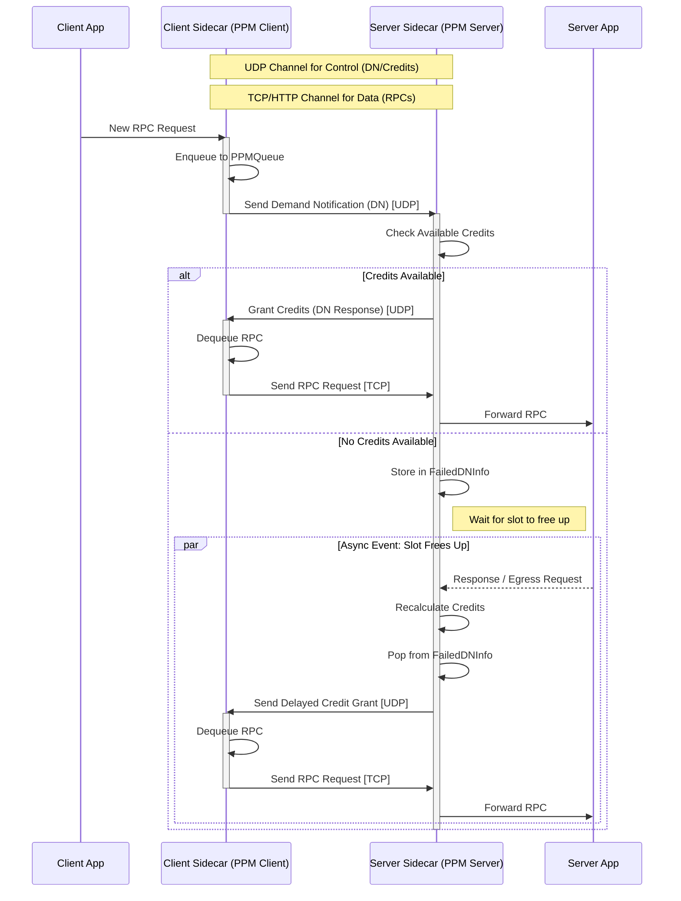

PPM is a protocol that ensures services only receive requests up to their configured limit.

# Message Types
1. Demand Notification (DN): Used to inform a server that the client has a number of requests to send. An important field is "requested credits". Note that this is only sent for new arriving requests to the client.
2. Credit response: It uses a the same header and structure as DN. It is distinguished from DN by setting a field. An important field is "granted credits". This type is the explciit response to a DN. In other words, there is a 1-to-1 mapping between DN and credit response.

# Protocol State
PPM is a stateful protocol, so both client and server rely on some state variables.

## Client-side
1. PPMQueue: It holds requests that should be sent to server using the PPM protocol.

## Server-side
1. in_flight: This is number indicating how many requests are either active in the server or on the way to the server.
2. failed_dn_info: This is a collection of FIFO queues, one for each service. It holds rejected DNs. When a credit becomes available, the server prioritizes granting credits to the service with the **lowest average response time** (latency) among those with pending DNs. Within a specific service, requests are handled in FIFO order.

# Logic

## Client-side

### Every READ event

1. At some point `State::ppm_client` is called (See `rpc_flow.md` for details).
2. New RPCs are added to PPMQueue.
3. A DN is sent for every new RPC (no batching).

### On every credit reply

1. At some point `State::ppm_client` is called (See `rpc_flow.md` for details).
2. Dequeue an RPC from PPMQueue and send it.
5. Decrement in_flight by 1.

## Server-side

### On every DN

1. `State::queue_multiplexer` gets called.
2. Checks if the in_flight is less than limit.
3. If the in_flight is less than limit, the grant it and increment in_flight. Otherwise, store the rejected DN info in a global queue (shared among all threads).

### When a credit becomes available
1. Increment in_flight by 1.
2. We pop from the global queue and start sending credits.

# Note about sidecar roles
In every deployment, we definitely have one sidecar as Ingress, one as Frontend. Rest of the sidecars are neither ingress nor frontend.

A simple topology is shown below:

External clients --HTTP/1 (without PPM protocol)--> Ingress --HTTP/1 (with PPM protocol)--> Frontend --HTTP/2 (with PPM protocol)--> Backend 1 --HTTP/2 (with PPM protocol)--> ...

**Role-Specific Logic:**
*   **Ingress**: 
    *   **Drops**: Dropping Logic (`local_state.drops` and associated checks) **only happens at the Ingress sidecar**. Downstream sidecars (Frontend/Backend) do not drop requests (at all).
    *   **Credits**: The Ingress sidecar (receiving external traffic) does **not** use the `in_flight` credit accounting mechanism for admission control. Credits are strictly for the internal PPM protocol between mesh services.
*   **Mesh Services**: Strictly enforce PPM credits and do not drop requests (at all).

# Visual Flow

