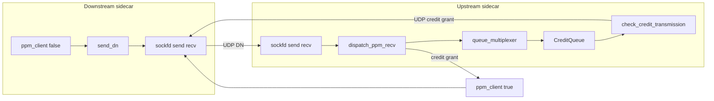

# UDP / PPM internals

This document describes how demand notifications (DNs) and credit messages are sent and received over UDP in the sidecar: sockets, io_uring, buffer pools, and the main code paths. For protocol semantics and limits, see [ppm_logic.md](ppm_logic.md). For when `ppm_client` runs relative to HTTP handling, see [rpc_flow.md](rpc_flow.md). For header byte meanings used in RTT measurement, see [rtt.md](rtt.md).

## Single PPM UDP socket

| Socket | File / symbol | Role |
|--------|---------------|------|
| PPM | `State::sockfd` | Created in `State` ctor (`state.cc`) as `AF_INET` / `SOCK_DGRAM`, **`bind` to `ingress_listener_port`** with **`SO_REUSEPORT`** for multi-thread sidecars. **Sends** DNs (`send_dn`), credit replies from `check_credit_transmission`, and credit returns (dfanout path). **Receives** all inbound PPM datagrams on one multishot `recvmsg`. |

TCP ingress and UDP PPM may share the same port number (`ingress_listener_port`); the kernel distinguishes them by protocol.

## Receive demux: `dispatch_ppm_recv`

After `handle_multishot_recv`, the event loop calls `State::dispatch_ppm_recv` (`state.cc`), which inspects the payload header (minimum length checks, then bytes 1–2):

| Condition | Handler |
|-----------|---------|
| `data[1] == 0x02` | `queue_multiplexer` — credit return (`decrement_in_flight`) |
| `data[1] == 0x01` && `data[2] == 0x00` | `queue_multiplexer` — DN request |
| `data[1] == 0x01` && `data[2] == 0x01` | `ppm_client(true, buffer)` — credit grant (response to our DN) |

Unknown combinations `LOG(FATAL)`.

## io_uring: receive and send

**Receive (multishot recvmsg + buffer selection)**

- `RingWrapper::prepare_rcvmsg(fd, ud)` issues `io_uring_prep_recvmsg_multishot` on `state.get_sockfd()`, sets `IOSQE_BUFFER_SELECT`, and **`sqe->buf_group = 1`** so the kernel picks buffers from the **UDP / DN** buffer ring, not TCP’s group `0` (`ring_wrapper.cc`).
- On completion, `RingWrapper::handle_multishot_recv` parses `io_uring_recvmsg_out`, copies the peer address into `Buffer::set_addr`, skips name/control regions, memmoves the UDP payload to the start of `buffer->data`, and calls `set_filled(payload_len)`.

**Send**

- Outgoing DN: `RingWrapper::prepare_sendmsg_with_serveraddr` — `Buffer::prepare_sendmsg(servaddr)`, then `io_uring_prep_sendmsg` (`ring_wrapper.cc`, `buffer.cc`).
- Credit reply to a peer that sent a DN: `Buffer::prepare_sendmsg(req->get_addr())` in `write_failed_dn_response` before the response is queued; later `check_credit_transmission` calls `RingWrapper::prepare_sendmsg(sockfd, ...)`.
- Credit return: same `sockfd` + `prepare_sendmsg` with peer address from the grant datagram.

## Buffer management

**Two io_uring buffer groups** are registered in `RingWrapper`’s constructor: `bgid 0` for TCP reads, `bgid 1` for UDP/PPM. `add_buffer_to_ring(buffer, bgid)` adds a slab back after use (`ring_wrapper.cc`).

**DN buffers** live in `BufferManager::dn_buffer_vector`, each `Buffer(256, index)` where logical indices for DN slots are offset by `count` from TCP buffer indices (`buffer_manager.cc`). When a CQE carries `IORING_CQE_F_BUFFER`, the buffer index is decoded and `get_dn_buffer_by_index` subtracts `count` to recover the DN slot.

**Pool behaviour**: For both TCP and DN pools, roughly the first 80% of buffers are marked `is_provided` and returned to the io_uring buffer ring on `free_*`; the rest are pushed onto a free queue and only registered when allocated (`buffer_manager.cc`).

**UDP-specific `Buffer` fields**: `Buffer::prepare_sendmsg` sets `iov` and `msg` for `sendmsg`. `enter_queue_ts` is set when a credit response buffer is queued in `CreditQueue` and later used in `check_credit_transmission` to overwrite bytes 22–25 (queue dwell), as in [rtt.md](rtt.md).

## `UserData` (per-SQE metadata)

`UserData` (`ring_helper.hpp`) carries `Operation op` and the `Buffer` for sends via `set_buffer`. The `UDPType` enum remains on `UserData` for legacy / logging; **receive dispatch no longer uses it** — routing is by PPM header in `dispatch_ppm_recv`.

Instances come from `BufferManager::get_user_data()` and are returned with `free_user_data` (`buffer_manager.cc`).

**Important:** On **`Operation::RCVMSG`** completion, `event_loop.cc` does **not** call `free_user_data`. Multishot recv keeps the submission active; the same `UserData` remains associated with the operation. By contrast, `SENDMSG`, `ACCEPT`, `READ` (when not continuing multishot in error paths), `CONNECT`, and `CANCEL` paths return `UserData` to the pool after handling.

## Event-loop call graph

| Phase | Trigger | Key calls |
|--------|---------|-----------|
| Outbound DN | After HTTP work; see [rpc_flow.md](rpc_flow.md) | `State::ppm_client(false, nullptr)` → `send_dn` → `ring.prepare_sendmsg_with_serveraddr(sockfd, ..., addr)` |
| Inbound PPM | `RCVMSG` on `sockfd` | `handle_multishot_recv` → `dispatch_ppm_recv` → `queue_multiplexer` and/or `ppm_client(true, ...)` |
| DN accepted | via `dispatch_ppm_recv` → QM | `shared_state.credit_queue.push` → `check_credit_transmission` → may `ring.prepare_sendmsg(sockfd, ...)` |
| Credit grant | `dispatch_ppm_recv` → `ppm_client(true, buffer)` | `valid_credit`, RTT from header → may `forward_request`, `fanout_req_management` |
| Credit return | `dispatch_ppm_recv` → QM `0x02` branch | `decrement_in_flight` → `check_credit_transmission` |
| Slot freed (ingress path) | Response forwarded on ingress side | `credit_queue.decrement_in_flight` → `check_credit_transmission` (`state.cc`) |

## Queue multiplexer and credit queue

- `queue_multiplexer` handles DN **requests** (`data[1] == 0x01`, `data[2] == 0x00`) and **credit returns** (`data[1] == 0x02`). For DN requests it reads service name, RPC id, priority, and piggyback RTT (bytes 22–25), calls `update_limits`, allocates a DN buffer, and builds the wire response with `write_failed_dn_response`. That helper copies the request, sets the response bit (`data[2]`), and sets **granted credits** in `data[4]` when a full credit is represented—so `valid_credit` sees `data[3] - data[4] == 0` when the client receives that reply (`state.cc`).
- The response buffer gets `enter_queue_ts` and is pushed into the shared `CreditQueue` (priority-aware). `check_credit_transmission` calls `CreditQueue::pop`, which enforces global and per-endpoint limits and **increments `in_flight`** when it hands out a buffer to send (`credit_queue.cc`). Before `sendmsg`, bytes 22–25 are replaced with credit-queue dwell time (`state.cc`).

## Related symbols (quick map)

- **Buffers:** `BufferManager::get_dn_buffer`, `get_dn_buffer_by_index`, `free_dn_buffer`
- **Ring:** `RingWrapper::prepare_rcvmsg`, `handle_multishot_recv`, `prepare_sendmsg`, `prepare_sendmsg_with_serveraddr`
- **State:** `send_dn`, `dispatch_ppm_recv`, `queue_multiplexer`, `check_credit_transmission`, `ppm_client`, `valid_credit`, `extract_service_from_ppm_req`
- **Types:** `Operation`, `UserData`, `UDPType` in `ring_helper.hpp`

## Further reading

- [ppm_logic.md](ppm_logic.md) — PPM limits, active requests, client/server state
- [rpc_flow.md](rpc_flow.md) — Ingress / frontend / backend HTTP flow and `ppm_client` timing
- [rtt.md](rtt.md) — PPM header timing fields and RTT decomposition
