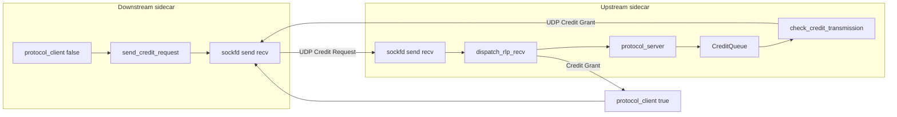

# UDP / Request Limit Protocol (RLP) internals

This document describes how Credit Requests and credit messages are sent and received over UDP in the sidecar: sockets, io_uring, buffer pools, and the main code paths. For protocol semantics and limits, see [rlp_logic.md](rlp_logic.md). For when `protocol_client` runs relative to HTTP handling, see [rpc_flow.md](rpc_flow.md). For header byte meanings used in RTT measurement, see [rtt.md](rtt.md).

## Single RLP UDP socket

| Socket | File / symbol | Role |
|--------|---------------|------|
| RLP | `State::sockfd` | Created in `State` ctor (`state.cc`) as `AF_INET` / `SOCK_DGRAM`. **Non-ingress** mesh sidecars **`bind`** to `ingress_listener_port` with **`SO_REUSEPORT`**. **Ingress** leaves the socket **unbound** so replies match the ephemeral source of each Credit Request. **Sends** Credit Requests (`send_credit_request`), Credit Grants from `check_credit_transmission`, and **credit returns** (`0x02`): dfanout path and **ingress** when **all** ingress deque RPCs miss deadline after a grant. **Receives** inbound RLP datagrams on multishot `recvmsg` where configured.

TCP ingress and UDP RLP may share the same port number (`ingress_listener_port`) on mesh nodes; the kernel distinguishes them by protocol.

## Receive demux: `dispatch_rlp_recv`

After `handle_multishot_recv`, the event loop calls `State::dispatch_rlp_recv` (`state.cc`), which inspects the payload header (minimum length checks, then bytes 1–2):

| Condition | Handler |
|-----------|---------|
| `data[1] == 0x02` | `protocol_server` — credit return (`decrement_in_flight`) |
| `data[1] == 0x01` && `data[2] == 0x00` | `protocol_server` — Credit Request |
| `data[1] == 0x01` && `data[2] == 0x01` | **Ingress:** `ingress_post_credit` — single credit, `Ingress::dequeue` (optional → else `prepare_credit_return` `0x02`), `forward` EGRESS UPSTREAM for 503s, `ingress_pre_credit`. **Others:** `protocol_client(true, buffer)` — Credit Grant |

Unknown combinations `LOG(FATAL)`.

## io_uring: receive and send

**Receive (multishot recvmsg + buffer selection)**

- `RingWrapper::prepare_rcvmsg(fd, ud)` issues `io_uring_prep_recvmsg_multishot` on `state.get_sockfd()`, sets `IOSQE_BUFFER_SELECT`, and **`sqe->buf_group = 1`** so the kernel picks buffers from the **UDP** buffer ring, not TCP’s group `0` (`ring_wrapper.cc`).
- On completion, `RingWrapper::handle_multishot_recv` parses `io_uring_recvmsg_out`, copies the peer address into `Buffer::set_addr`, skips name/control regions, memmoves the UDP payload to the start of `buffer->data`, and calls `set_filled(payload_len)`.

**Send**

- Outgoing Credit Request: `RingWrapper::prepare_sendmsg_with_serveraddr` — `Buffer::prepare_sendmsg(servaddr)`, then `io_uring_prep_sendmsg` (`ring_wrapper.cc`, `buffer.cc`).
- Credit Grant to a peer that sent a Credit Request: `Buffer::prepare_sendmsg(req->get_addr())` in `write_full_credit_grant` (builds the grant via `write_credit_grant`) before the Credit Grant is queued; later `check_credit_transmission` calls `RingWrapper::prepare_sendmsg(sockfd, ...)`.
- Credit return: same `sockfd` + `prepare_sendmsg` with peer address from the template datagram (dfanout / **ingress** grant buffer).

## Buffer management

**Two io_uring buffer groups** are registered in `RingWrapper`’s constructor: `bgid 0` for TCP reads, `bgid 1` for UDP/RLP. `add_buffer_to_ring(buffer, bgid)` adds a slab back after use (`ring_wrapper.cc`).

**UDP buffers** live in `BufferManager::udp_buffer_vector`, each `Buffer(256, index)` where logical indices for UDP slots are offset by `count` from TCP buffer indices (`buffer_manager.cc`). When a CQE carries `IORING_CQE_F_BUFFER`, the buffer index is decoded and `get_udp_buffer_by_index` subtracts `count` to recover the UDP slot.

**Pool behaviour**: For both TCP and UDP pools, roughly the first 80% of buffers are marked `is_provided` and returned to the io_uring buffer ring on `free_*`; the rest are pushed onto a free queue and only registered when allocated (`buffer_manager.cc`).

**UDP-specific `Buffer` fields**: `Buffer::prepare_sendmsg` sets `iov` and `msg` for `sendmsg`. `enter_queue_ts` is set when a Credit Grant buffer is queued in `CreditQueue` and later used in `check_credit_transmission` to overwrite bytes 23–26 (queue dwell), as in [rtt.md](rtt.md).

## `UserData` (per-SQE metadata)

`UserData` (`ring_helper.hpp`) carries `Operation op` and the `Buffer` for sends via `set_buffer`. The `UDPType` enum remains on `UserData` for legacy / logging; **receive dispatch no longer uses it** — routing is by RLP header in `dispatch_rlp_recv`.

Instances come from `BufferManager::get_user_data()` and are returned with `free_user_data` (`buffer_manager.cc`).

**Important:** On **`Operation::RCVMSG`** completion, `event_loop.cc` does **not** call `free_user_data`. Multishot recv keeps the submission active; the same `UserData` remains associated with the operation. By contrast, `SENDMSG`, `ACCEPT`, `READ` (when not continuing multishot in error paths), `CONNECT`, and `CANCEL` paths return `UserData` to the pool after handling.

## Event-loop call graph

| Phase | Trigger | Key calls |
|--------|---------|-----------|
| Outbound Credit Request | After TCP READ handling | **Ingress:** `ingress_pre_credit` → `send_credit_request` → `prepare_sendmsg_with_serveraddr`. **Other clients:** `protocol_client(false, nullptr)` drains `rpc_queue` / `PPMQueue` then `send_credit_request` |
| Inbound RLP | `RCVMSG` on `sockfd` | `handle_multishot_recv` → `dispatch_rlp_recv` → `protocol_server` and/or grant handler below |
| Credit Request accepted (server) | `dispatch_rlp_recv` → `protocol_server` | `shared_state.credit_queue.push` → `check_credit_transmission` → may `ring.prepare_sendmsg(sockfd, ...)` |
| Credit Grant | `dispatch_rlp_recv` | **Ingress:** `ingress_post_credit`. **Others:** `protocol_client(true, buf)` → `fanout_req_management` / `PPMQueue::pop` / `send_sub_request` |
| Credit return | `dispatch_rlp_recv` → `protocol_server` `0x02` branch | `decrement_in_flight` → `check_credit_transmission` |
| Slot freed (ingress path) | Response forwarded on ingress side | `credit_queue.decrement_in_flight` → `check_credit_transmission` (`state.cc`) |

## Protocol Server and credit queue

- `protocol_server` handles Credit **Requests** (`data[1] == 0x01`, `data[2] == 0x00`) and **credit returns** (`data[1] == 0x02`). For Credit Requests it reads service name, RPC id, priority, and piggyback RTT (bytes 23–26), calls `update_limits`, allocates a UDP buffer, and builds the Credit Grant with `write_full_credit_grant` (via `write_credit_grant`). That helper copies the request, sets the Credit Grant bit (`data[2]`), and sets **granted credits** in `data[4]` when a full credit is represented—so `valid_credit` sees `data[3] - data[4] == 0` when the client receives that Credit Grant (`state.cc`).
- The Credit Grant buffer gets `enter_queue_ts` and is pushed into the shared `CreditQueue` (priority-aware). `check_credit_transmission` calls `CreditQueue::pop`, which enforces global and per-endpoint limits and **increments `in_flight`** when it hands out a buffer to send (`credit_queue.cc`). Before `sendmsg`, bytes 23–26 are replaced with credit-queue dwell time (`state.cc`).

## Related symbols (quick map)

- **Buffers:** `BufferManager::get_udp_buffer`, `get_udp_buffer_by_index`, `free_udp_buffer`
- **Ring:** `RingWrapper::prepare_rcvmsg`, `handle_multishot_recv`, `prepare_sendmsg`, `prepare_sendmsg_with_serveraddr`
- **State:** `send_credit_request`, `dispatch_rlp_recv`, `protocol_server`, `check_credit_transmission`, `protocol_client`, `ingress_pre_credit`, `ingress_post_credit`, `prepare_credit_return`, `credit_post_process`, `extract_service_from_rlp_req`
- **Types:** `Operation`, `UserData`, `UDPType` in `ring_helper.hpp`

## Further reading

- [rlp_logic.md](rlp_logic.md) — RLP limits, active requests, client/server state
- [rpc_flow.md](rpc_flow.md) — Ingress / frontend / backend HTTP flow and `protocol_client` timing
- [rtt.md](rtt.md) — RLP header timing fields and RTT decomposition
